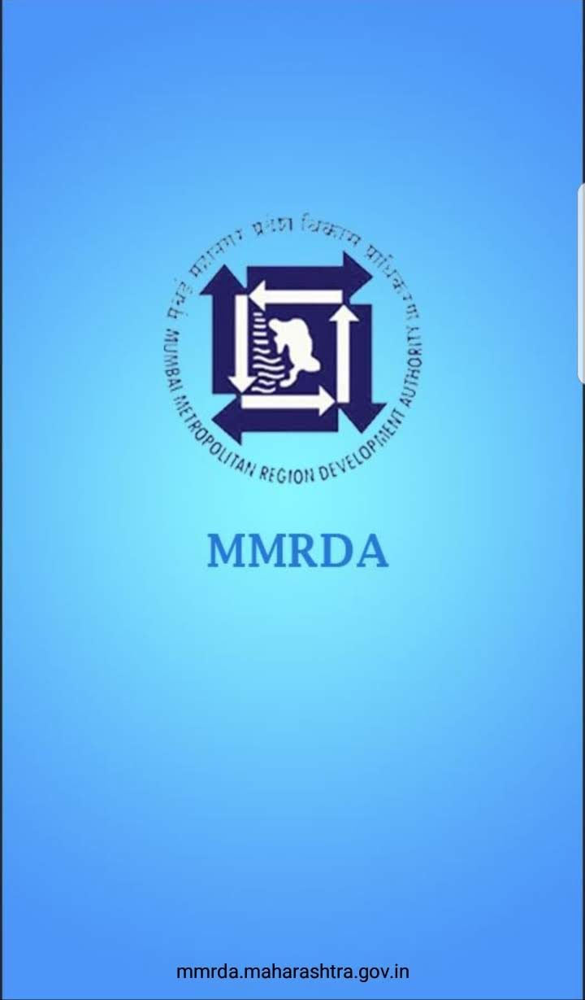
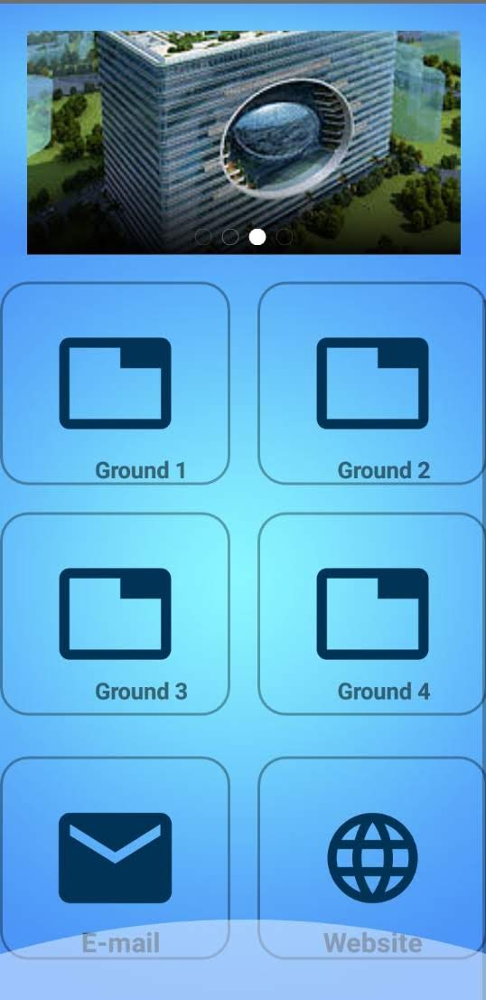
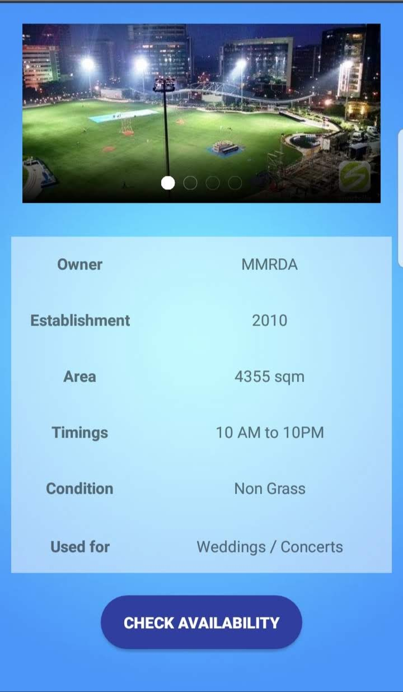
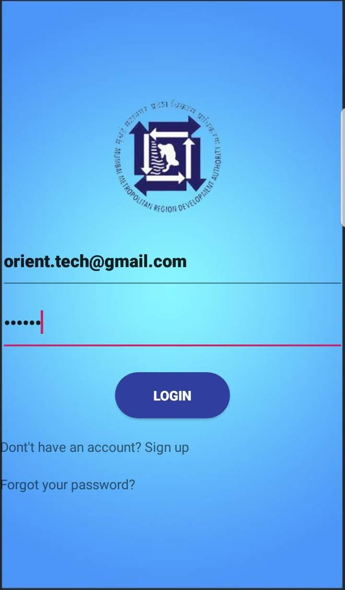
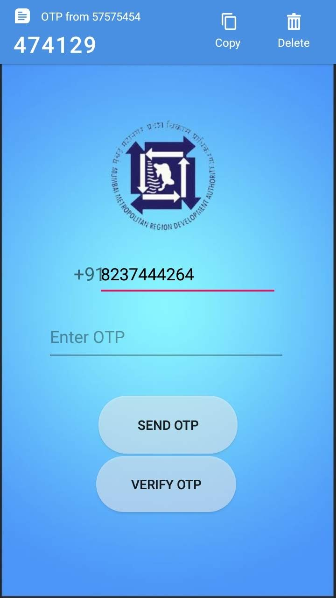
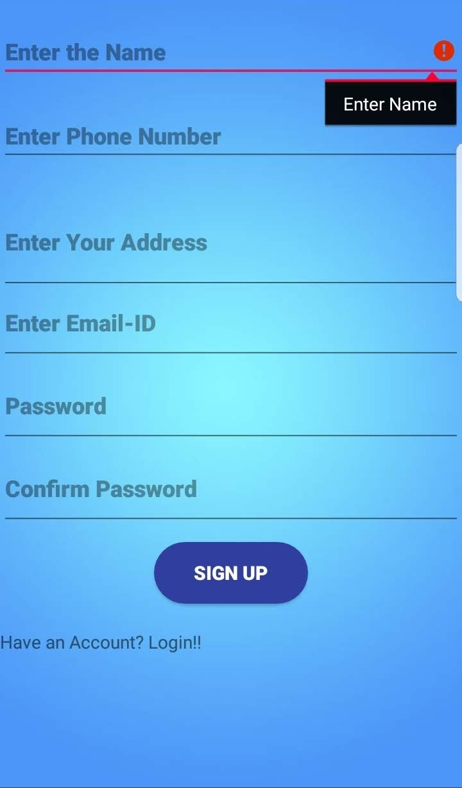
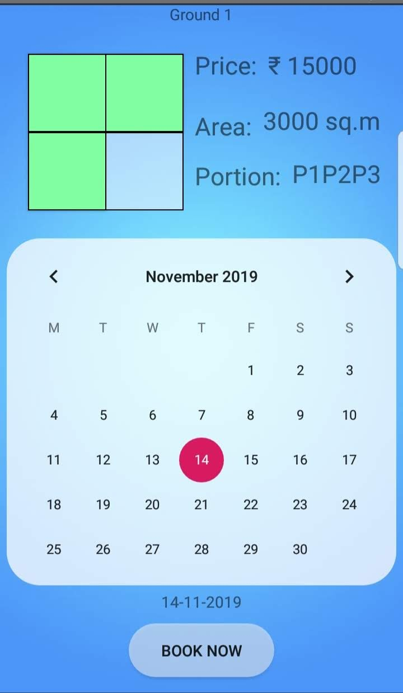
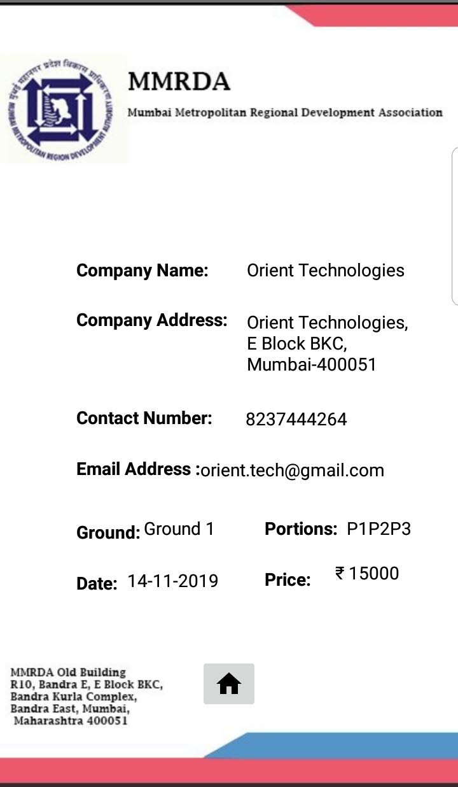

# Mumbai Metropolitan Region Development Authority

## Software Engineering Internship at Orient Technologies Pvt. Ltd

**Internship Duration:** May 2019 – June 2019

## Project Overview

During my software engineering internship at Orient Technologies Pvt. Ltd, I had the opportunity to work on a project for the Mumbai Metropolitan Region Development Authority. Under the guidance of the IT-Cell Head of the company, I developed a Ground Booking Android application.

### Project Details

- **Application Name:** Ground Booking Android Application

- **Technology Stack:** Android Studio, Java, Firebase, XML

## Key Features

The Ground Booking Android application I developed offers the following key features:

- **Availability Checking:** Users can check the availability of grounds in their desired locations.

- **Visual Preview:** The application provides pictures of the grounds to help users make informed choices.

- **Flexible Booking:** Users can book portions of the ground according to their requirements.

- **OTP Verification:** To enhance security, the application incorporates OTP (One-Time Password) verification.

- **E-bill:** Users receive electronic bills (E-bills) for their bookings.

## Implementation

## Contributing

I welcome contributions to improve and expand the Ground Booking Android application project. If you'd like to add features, fix bugs, or enhance the user interface, follow these steps:

1. **Fork the Repository:** Create your own copy of the project by forking it.

2. **Make Changes:** Create a new branch, make your changes, and commit them.

3. **Submit a Pull Request:** Push your changes to your forked repository and submit a pull request to the main repository.

## Contact

If you have any questions, suggestions, or would like to collaborate on this project, please feel free to reach out to me:

- Email: glendhingra27@gmail.com

I aim to provide a convenient solution for ground booking and appreciate your support and contributions.
